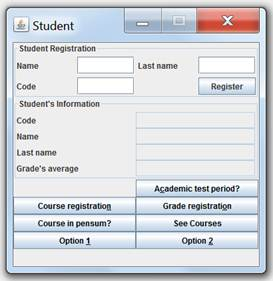

# Enunciado

## Problem Description

The objective is to create an application for the management of the student's courses.
The student's personal data is the name, last name and code. The student can only take
5 courses in the semester. Each course has a name, a code and the number of credits.
At the end of the course, a grade is given to the student; this will be between 1.5
and 5.0.

The student will enter into an academic test period if his grade's average is lower
than 3.25. This average is calculated with the grades of the courses he has ended,
according to their number of credits: so it's the sum of the multiplications between
the number of credits and the grade the student got, divided by the sum of all the
credits.

For example, the student has ended two courses Calculus 1 and Physics 1, the first
one has 4 credits and the second one has 3. The student's grades are:

Calculus 1: 4.5

Physics 1: 3.5

So the student's grade's average is calculated by:

(4.5*4+ 3.5*3)/ 7 = 4.07

The application must be able to register the student, register 5 courses to the student,
tell if a course is in the student's pensum, assign the student's course's grades,
calculate the average with the subjects that have grades and indicate if the student
is in an academic test period.

La aplicación debe permitir registrar al estudiante, registrarle los 5 cursos al
estudiante, decir si un curso está en el pensum del estudiante, asignar las notas
de los cursos del estudiante, calcular el promedio con aquellas materias que tienen
nota e indicar si está en prueba académica.

# Interfaz GUI

